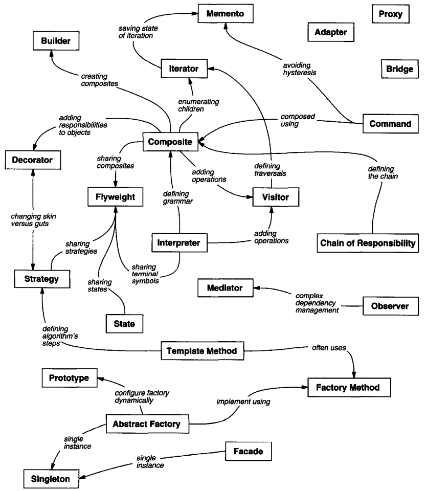

# Chapter 1: Introduction

## 1.1 What Is a Design Pattern?

In general, a pattern has four essential elements:

* The *pattern name* is a handle we can use to describe a design problem, its solutions, and consequences in a word or two.
* The *problem* describes when to apply the pattern.
* The *solution* describes the elements that make up the design, their relationships, responsibilities, and collaborations.
* The *consequences* are the results and trade-offs of applying the pattern.

## 1.2 Design Patterns in MVC

Model/View/Controller (MVC) consists of three kinds of objects. The Model is the application object, the View is its screen presentation, and the Controller defines the way the user interface reacts to user input.

MVC uses other design patterns, such as Factory Method to specify the default controller class for a view and Decorator to add scrolling to a view. But the main relationships in MVC are given by the Observer, Composite, and Strategy design patterns.

## 1.5 The Catalog

|           |            |                  |      Purpose     |                         |
|-----------|------------|------------------|------------------|-------------------------|
|           |            |  **Creational**  |  **Structural**  |      **Behavioral**     |
| **Scope** |  **Class** | Factory Method   | Adapter (class)  | Interpreter             |
|           |            |                  |                  | Template Method         |
|           | **Object** | Abstract Factory | Adapter (object) | Chain of Responsibility |
|           |            | Builder          | Bridge           | Command                 |
|           |            | Prototype        | Composite        | Iterator                |
|           |            | Singleton        | Decorator        | Mediator                |
|           |            |                  | Facade           | Memento                 |
|           |            |                  | Flyweight        | Observer                |
|           |            |                  | Proxy            | State                   |
|           |            |                  |                  | Strategy                |
|           |            |                  |                  | Visitor                 |

## 1.6 How Design Patterns Solve Design Problems

**Finding Appropriate Objects**

The hard part about object-oriented design is decomposing a system into objects. The task is difficult because many factors come into play: encapsulation, granularity, dependency, flexibility, performance, evolution, reusability, and on and on. They all influence the decomposition, often in conflicting ways.

Strict modeling of the real world leads to a system that reflects today's realities but not necessarily tomorrow's. The abstractions that emerge during design are key to making a design flexible.

Design patterns help you identify less-obvious abstractions and the objects that can capture them.

**Determining Object Granularity**

Design patterns address the issue about how to decide what should be an object, since they (the objects) can vary tremendously in size and number. They can represent everything down to the hardware or all the way up to entire applications.

**Specifying Object Interfaces**

The set of all signatures defined by an object's operations is called the interface to the object. An object's interface characterizes the complete set of requests that can be sent to the object. Any request that matches a signature in the object's interface may be sent to the object.

Design patterns help you define interfaces by identifying their key elements and the kinds of data that get sent across an interface. A design pattern might also tell you what not to put in the interface.

Design patterns also specify relationships between interfaces. In particular, they often require some classes to have similar interfaces, or they place constraints on the interfaces of some classes.

**Specifying Object Implementations**

**Putting Reuse Mechanisms to Work**

Most people can understand concepts like objects, interfaces, classes, and inheritance. The challenge lies in applying them to build flexible, reusable software, and design patterns can show you how.

**Design patterns relationships**

