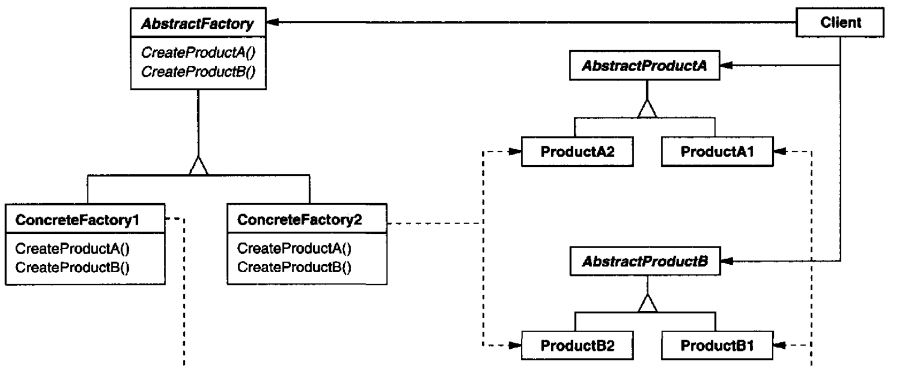
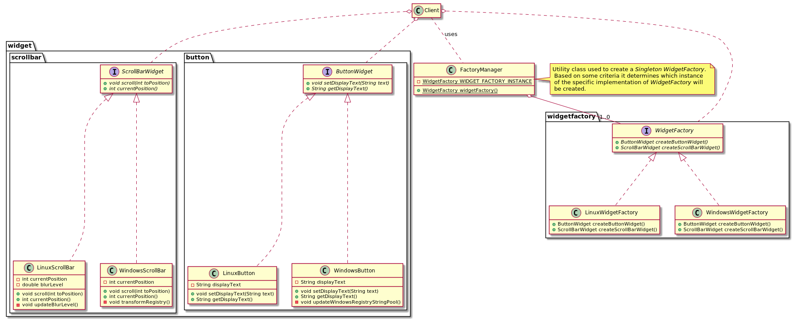

# Abstract Factory

## Intent

Provide an interface for creating families of related or dependent objects without specifying their concrete classes.

## Also Known As

Kit

## Applicability

* a system should be independent of how its products are created, composed, and represented
* a system should be configured with one of multiple families of products
* a family of related product objects is designed to be used together, and you need to enforce this constraint
* you want to provide a class library of products, and you want to reveal just their interfaces, not their implementations

## Structure



## Participants

* **`AbstractFactory`**: declares an interface for operations that create abstract product objects
* **`ConcreteFactory`**: implements the operations to create concrete product objects
* **`AbstractProduct`**: declares an interface for a type of product object
* **`ConcreteProduct`**: defines a product object to be created by the corresponding concrete factory and implements the AbstractProduct interface
* **`Client`**: uses only interfaces declared by AbstractFactory and AbstractProduct classes

## Collaborations

* Normally a single instance of a `ConcreteFactory` class is created at run-time. This concrete factory creates product objects having a particular implementation. To create different product objects, clients should use a different concrete factory.
* `AbstractFactory` defers creation of product objects to its `ConcreteFactory` subclass

## Consequences

* It isolates concrete classes
* It makes exchanging product families easy
* It promotes consistency among products
* Supporting new kinds of products is difficult.

## Related Patterns

`AbstractFactory` classes are often implemented with factory methods (*FactoryMethod* pattern), but they can also be implemented using the *Prototype* pattern.

A concrete factory is often a singleton (*Singleton* pattern).

## Example in Java



```
package widget.scrollbar;

public interface ScrollBarWidget {
    void scroll(int toPosition);
    int currentPosition();
}

public class LinuxScrollBar implements ScrollBarWidget {
    private int currentPosition;
    private double blurLevel;

    @Override
    public void scroll(int toPosition) {
        this.currentPosition = toPosition;
        this.updateBlurLevel();
    }

    @Override
    public int currentPosition() {
        if (blurLevel == 1) {
            throw new IllegalStateException("An inconsistent state has been reached");
        }
        return currentPosition;
    }

    private void updateBlurLevel(){
        this.blurLevel = currentPosition / 100D;
    }
}

public class WindowsScrollBar implements ScrollBarWidget {
    private int currentPosition;

    @Override
    public void scroll(int toPosition) {
        this.currentPosition = toPosition;

        this.transformRegistry();
    }

    @Override
    public int currentPosition() {
        return currentPosition;
    }

    private void transformRegistry(){
        // windows OS specific operation
    }
}
```

```
package widget.button;

public interface ButtonWidget {
    void setDisplayText(String text);
    String getDisplayText();
}

public class LinuxButton implements ButtonWidget {
    String displayText;

    @Override
    public void setDisplayText(String text) {
        displayText = text;
    }

    @Override
    public String getDisplayText() {
        return displayText;
    }
}

public class WindowsButton implements ButtonWidget {
    String displayText;

    @Override
    public void setDisplayText(String text) {
        displayText = text;
        updateWindowsRegistryStringPool();
    }

    @Override
    public String getDisplayText() {
        return displayText;
    }

    private void updateWindowsRegistryStringPool() {
        // windows OS specific operation
    }
}
```

```
package widgetfactory;

import widget.button.ButtonWidget;
import widget.scrollbar.ScrollBarWidget;

public interface WidgetFactory {
    ButtonWidget createButtonWidget();
    ScrollBarWidget createScrollBarWidget();
}
```

```
package widgetfactory;

import widget.button.ButtonWidget;
import widget.button.WindowsButton;
import widget.scrollbar.ScrollBarWidget;
import widget.scrollbar.WindowsScrollBar;

public class WindowsWidgetFactory implements WidgetFactory {
    @Override
    public ButtonWidget createButtonWidget() {
        return new WindowsButton();
    }

    @Override
    public ScrollBarWidget createScrollBarWidget() {
        return new WindowsScrollBar();
    }
}
```

```
package widgetfactory;

import widget.button.ButtonWidget;
import widget.button.LinuxButton;
import widget.scrollbar.LinuxScrollBar;
import widget.scrollbar.ScrollBarWidget;

public class LinuxWidgetFactory implements WidgetFactory {
    @Override
    public ButtonWidget createButtonWidget() {
        return new LinuxButton();
    }

    @Override
    public ScrollBarWidget createScrollBarWidget() {
        return new LinuxScrollBar();
    }
}
```

```
import widgetfactory.LinuxWidgetFactory;
import widgetfactory.WidgetFactory;
import widgetfactory.WindowsWidgetFactory;

public final class FactoryManager {
    private static final WidgetFactory WIDGET_FACTORY_INSTANCE = switch (System.getProperty("os.name")) {
        case "Linux" -> new LinuxWidgetFactory();
        case "Windows" -> new WindowsWidgetFactory();
        default -> null;
    };
    private FactoryManager() {}

    public static WidgetFactory widgetFactory() {
        if (WIDGET_FACTORY_INSTANCE == null) {
            throw new IllegalStateException("This program doesn't run on this Operating System");
        }
        return WIDGET_FACTORY_INSTANCE;
    }
}
```

```
public final class Client {
    public static void main(String[] args) {
        final WidgetFactory widgetFactory = FactoryManager.widgetFactory();

        ButtonWidget button = widgetFactory.createButtonWidget();
        ScrollBarWidget scrollBar = widgetFactory.createScrollBarWidget();
    }
}
```
