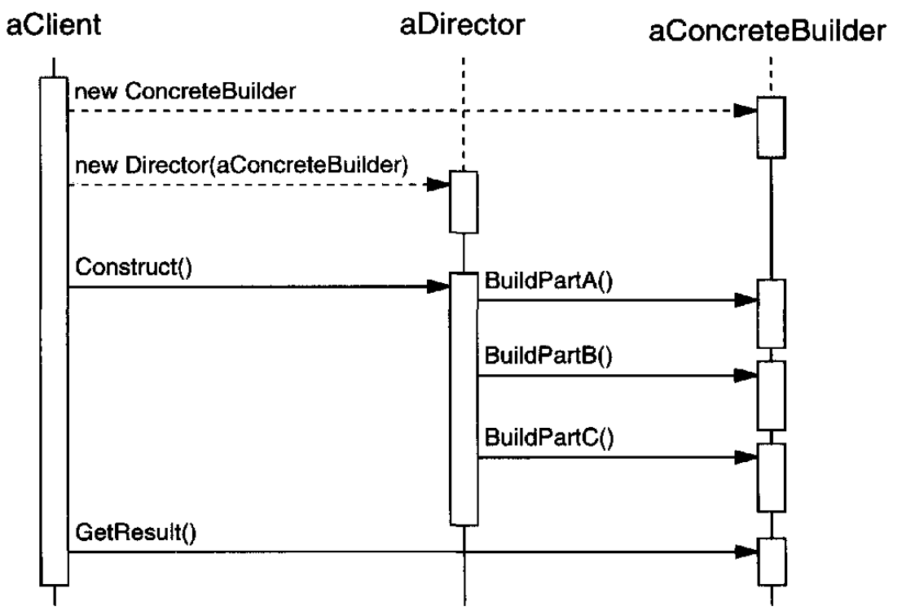

# Builder

## Intent

Separate the construction of a complex object from its representation so that the same construction process can create different representations.

## Applicability

* the algorithm for creating a complex object should be independent of the parts that make up the object and how they're assembled
* the construction process must allow different representations for the object that's constructed

## Structure

## Participants

* **`Builder`**: specifies an abstract interface for creating parts of a *Product* object
* **`ConcreteBuilder`**:
  - constructs and assembles parts of the product by implementing the Builder interface
  - defines and keeps track of the representation it creates
  - provides an interface for retrieving the product
* **`Director`**: constructs an object using the Builder interface
* **`Product``**:
  - represents the complex object under construction. `ConcreteBuilder` builds the product's internal representation and defines the process by which it's assembled
  - includes classes that define the constituent parts, including interfaces for assembling the parts into the final result

## Collaborations

* The client creates the Director object and configures it with the desired `Builder` object
* `Director` notifies the builder whenever a part of the product should be built
* `Builder` handles requests from the director and adds parts to the product
* The client retrieves the product from the builder

## Consequences

* It lets you vary a product's internal representation
* It isolates code for construction and representation
* It gives you finer control over the construction process

## Related Patterns

*Abstract Factory* is similar to *Builder* in that it may construct complex objects as well. The primary difference is that the *Builder* pattern focuses on constructing a complex object step by step. *Abstract Factory*'s emphasis is on families of product objects (either simple or complex). *Builder* returns the product as a final step but as far as the Abstract Factory pattern is concerned, the product gets returned immediately.

A *Composite* is what the builder often builds.

