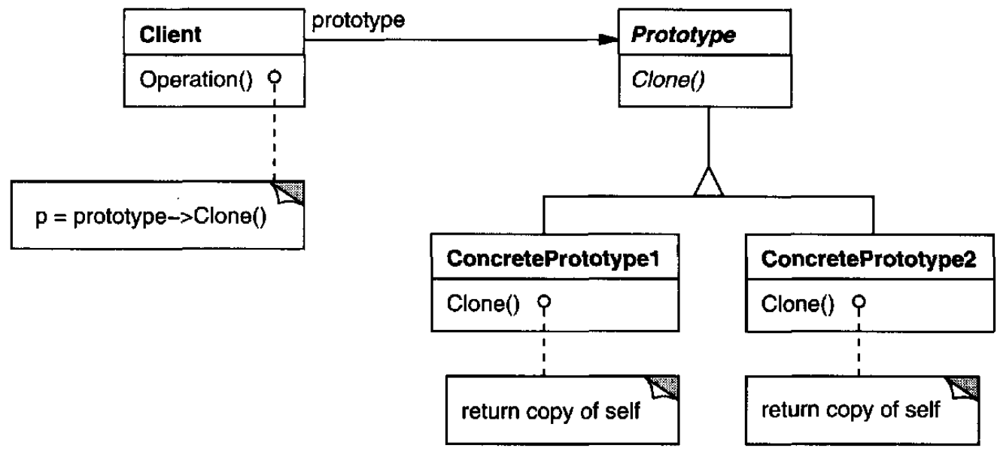

# Prototype

## Intent

Specify the kinds of objects to create using a prototypical instance, and create new objects by copying this prototype.

## Applicability

* a system should be independent of how its products are created, composed, and represented
* when the classes to instantiate are specified at run-time, for example, by dynamic loading
* to avoid building a class hierarchy of factories that parallels the class hierarchy of products
* when instances of a class can have one of only a few different combinations of state. It may be more convenient to install a corresponding number of prototypes and clone them rather than instantiating the class manually, each time with the appropriate state

## Structure

## Participants

* **`Prototype**: declares an interface for cloning itself
* **`ConcretePrototype`**: implements an operation for cloning itself
* **`Client`**: creates a new object by asking a prototype to clone itself

## Collaborations

A client asks a prototype to clone itself

## Consequences

* It hides the concrete product classes from the client, thereby reducing the number of names clients know about. Moreover, it lets a client work with application-specific classes without modification
* It allows adding and removing products at run-time
* It allows specifying new objects by varying values
* It allows specifying new objects by varying structure
* It allows reduced subclassing
* It allows configuring an application with classes dynamically
* The main **liability** of the *Prototype* pattern is that each subclass of `Prototype` must implement the `clone` operation, which may be difficult. For example, adding `clone` is difficult when the classes under consideration already exist. Implementing `clone` can be difficult when their internals include objects that don't support copying or have circular references

## Considerations

* If possible it is better for a *client* to use a *prototype manager* to retrieve the prototype objects (from a registry) before cloning it, instead of managing the prototypes itself
* The hardest part of the *Prototype* pattern is implementing the `clone` operation correctly

## Related Patterns

*Prototype* and *Abstract Factory* are competing patterns in some ways. They can also be used together, however. An *Abstract Factory* might store a set of prototypes from which to clone and return product objects.

Designs that make heavy use of the *Composite* and *Decorator* patterns often can benefit from *Prototype* as well.
