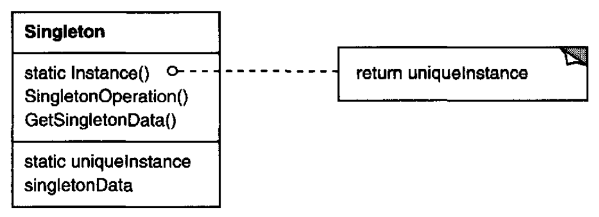

# Singleton

## Intent

Ensure a class only has one instance, and provide a global point of access to it.

## Applicability

* there must be exactly one instance of a class, and it must be accessible to clients from a well-known access point
* when the sole instance should be extensible by subclassing, and clients should be able to use an extended instance without modifying their code

## Structure

## Participants

* **`Singleton`**: defines an Instance operation that lets clients access its unique instance

## Collaborations

Clients access a Singleton instance solely through Singleton's Instance operation

## Consequences

### Benefits

* Controlled access to sole instance
* Reduced name space
* Permits refinement of operations and representation
* Permits a variable number of instances

## Related Patterns

Many patterns can be implemented using the Singleton pattern. i.e.: *Abstract Factory*, *Builder* and *Prototype*.
