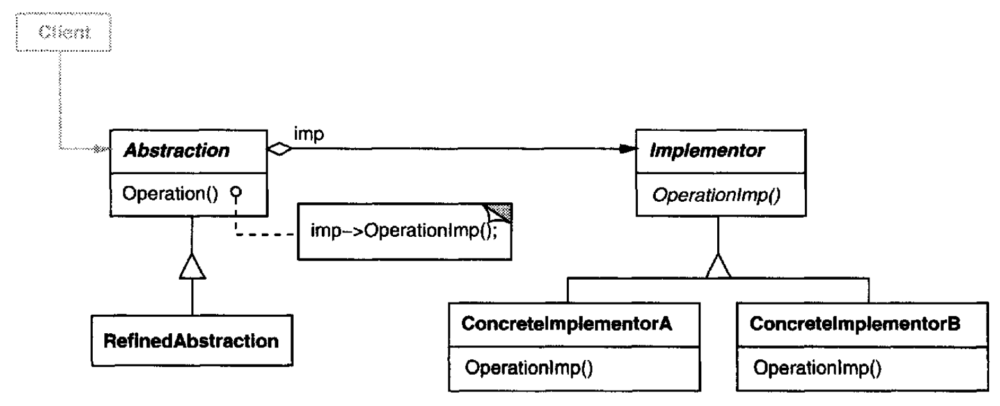

# Bridge

## Intent

Decouple an abstraction from its implementation so that the two can vary independently

## Also Known As

Handle/Body

## Applicability

* you want to avoid a permanent binding between an abstraction and its implementation. This might be the case, for example, when the implementation must be selected or switched at run-time
* both the abstractions and their implementations should be extensible by subclassing. In this case, the *Bridge* pattern lets you combine the different abstractions and implementations and extend them independently
* changes in the implementation of an abstraction should have no impact on clients; that is, their code should not have to be recompiled
* you have a proliferation of classes. Such a class hierarchy indicates the need for splitting an object into two parts. Rumbaugh uses the term "nested generalizations" to refer to such class hierarchies
* you want to share an implementation among multiple objects (perhaps using reference counting), and this fact should be hidden from the client

## Structure

## Participants

* **`Abstraction`**
  - defines the abstraction's interface
  - maintains a reference to an object of type `Implementor`
* **RefmedAbstraction**: Extends the interface defined by *Abstraction*
* **`Implementor`**: defines the interface for implementation classes. This interface doesn't have to correspond exactly to Abstraction's interface; in fact the two interfaces can be quite different. Typically the Implementor interface provides only primitive operations, and Abstraction defines higher-level operations based on these primitives
* **`Concretelmplementor`**: implements the Implementor interface and defines its concrete implementation

## Collaborations

`Abstraction` forwards client requests to its `Implementor` object

## Consequences

* Decoupling interface and implementation
* Improved extensibility
* Hiding implementation details from clients

## Related Patterns

An *Abstract Factory* can create and configure a particular *Bridge*.

The *Adapter* pattern is geared toward making unrelated classes work together. It is usually applied to systems after they're designed. *Bridge*, on the other hand, is used up-front in a design to let abstractions and implementations vary independently.
