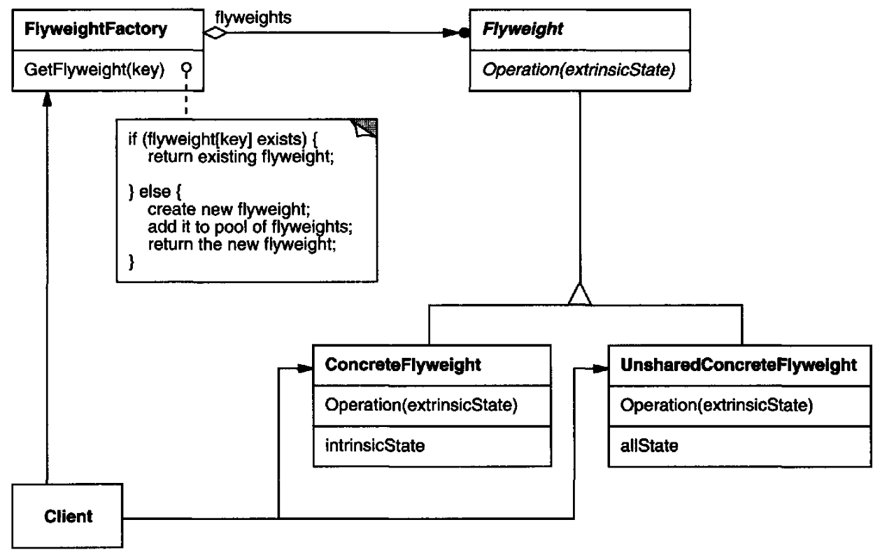
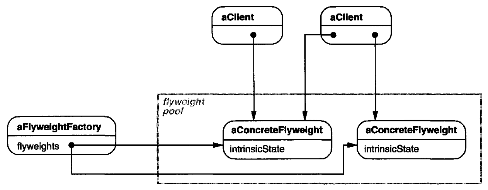

# Flyweight

## Intent

Use sharing to support large numbers of fine-grained objects efficiently.

## Applicability

The Flyweight pattern's effectiveness depends heavily on how and where it's used. Apply the Flyweight pattern when all of the following are true:

* An application uses a large number of objects
* Storage costs are high because of the sheer quantity of objects
* Most object state can be made extrinsic
* Many groups of objects may be replaced by relatively few shared objects once extrinsic state is removed
* The application doesn't depend on object identity. Since flyweight objects may be shared, identity tests will return true for conceptually distinct objects

## Structure

THe following diagram show how flyweights are shared:

## Participants

* **`Flyweight`**: declares an interface through which flyweights can receive and act on extrinsic state
* **`ConcreteFlyweight`**: implements the `Flyweight` interface and adds storage for intrinsic state, if any. A `ConcreteFlyweight` object must be sharable. Any state it stores must be intrinsic; that is, it must be independent of the `ConcreteFlyweight` object's context.
* **`UnsharedConcreteFlyweight`**: not all `Flyweight` subclasses need to be shared. The `Flyweight` interface *enables* sharing; it doesn't enforce it. It's common for `UnsharedConcreteFlyweight` objects to have `ConcreteFlyweight` objects as children at some level in the flyweight object structure
* **`FlyweightFactory`**:
  - creates and manages flyweight objects
  - ensures that flyweights are shared properly. When a client requests a flyweight, the `FlyweightFactory` object supplies an existing instance or creates one, if none exists
* **`Client`**:
  - maintains a reference to flyweight
  - computes or stores the extrinsic state of flyweight(s)
