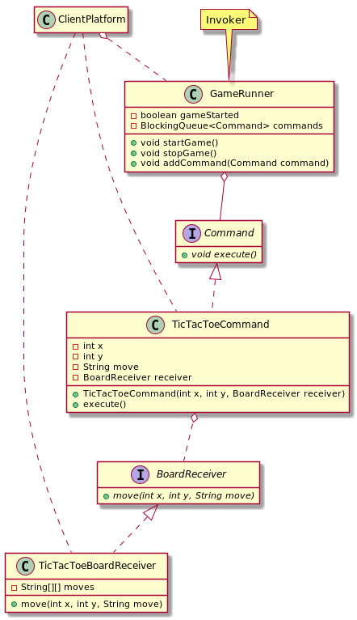

# Command

## Intent

Encapsulate a request as an object, thereby letting you parameterize clients with different requests, queue or log requests, and support undoable operations.

## Also Known As

Action, Transaction

## Applicability

* Parameterize objects by an action to perform. You can express such parameterization in a procedural language with a *callback* function, that is, a function that's registered somewhere to be called at a later point. *Commands* are an object-oriented replacement for callbacks.
* Specify, queue, and execute requests at different times. A *Command* object can have a lifetime independent of the original request. If the receiver of a request can be represented in an address space-independent way, then you can transfer a command object for the request to a different process and fulfill the request there.
* Support undo. The Command's *`execute`* operation can store state for reversing its effects in the command itself. The Command interface must have an added *`unexecute`* operation that reverses the effects of a previous call to `execute`. Executed commands are stored in a history list. Unlimited-level undo and redo is achieved by traversing this list backwards and forwards calling `unexecute` and `execute`, respectively.
* Support logging changes so that they can be reapplied in case of a system crash.
* structure a system around high-level operations built on primitives operations.

## Structure


## Participants

* **`Command`**: declares an interface for executing an operation
* **`ConcreteCommand`**:
  - defines a binding between a `Receiver` object and an action
  - implements `execute` by invoking the corresponding operation(s) on `Receiver`
* **`Client`**: creates a ConcreteCommand object and sets its receiver
* **`Invoker`**: asks the command to carry out the request
* **`Receiver`**: knows how to perform the operations associated with carrying out a request. Any class may serve as a `Receiver`

## Collaborations

* The client creates a `ConcreteCommand` object and specifies its receiver
* An `Invoker` object stores the `ConcreteCommand` object
* The invoker issues a request by calling `execute` on the command. When commands are undoable, `ConcreteCommand` stores state for undoing the command prior to invoking `execute`.
* The `ConcreteCommand` object invokes operations on its receiver to carry out the request

## Consequences

* *Command* decouples the object that invokes the operation from the one that knows how to perform it
* Commands are first-class objects. They can be manipulated and extended like any other object
* You can assemble commands into a composite command
* It's easy to add new Commands, because you don't have to change existing classes

## Related Patterns

* A *Composite* can be used to implement *MacroCommands*
* A Memento can keep state the command requires to undo its effect
* A command that must be copied before being placed on the history list acts as a *Prototype*

## Example in Java



```java
```
