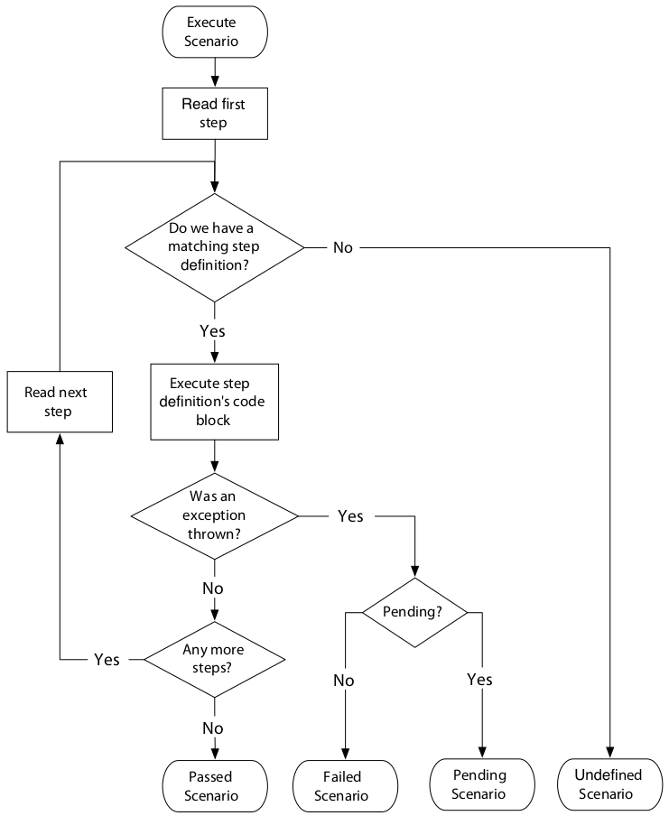

# Part I: Cucumber Fundamentals

## Chapter 1: Why Cucumber?

Software teams work best when the developers and business stakeholders are communicating clearly with one another. A great way to do that is to collaboratively specify the work that’s about to be done using automated acceptance tests.

When the acceptance tests are written as examples, they stimulate people’s imaginations and help them see other scenarios they hadn’t previously considered.

When the team members write their acceptance tests collaboratively, they can develop their own ubiquitous language for talking about their problem domain. This helps them avoid misunderstandings.

Cucumber was designed specifically to help business stakeholders get involved in writing acceptance tests.

Each test case in Cucumber is called a scenario, and scenarios are grouped into features. Each scenario contains several steps.

The business-facing parts of a Cucumber test suite, stored in feature files, must be written according to syntax rules—known as Gherkin—so that Cucumber can read them.

Under the hood, step definitions translate from the business-facing language of steps into code.

## Chapter 2: First Taste

### Step by step

Working outside-in with Cucumber helps us to stay focused. We can let Cucumber guide us through the work to be done, leaving us free to concentrate on creating an elegant solution. By running Cucumber every time we make a change, any mistakes we make are found and resolved quickly, and we get plenty of feedback and encouragement about our progress.

### Directory Structure

Cucumber needs you to specify where your features and step definition are kept.

### Gherkin

Cucumber tests are expressed using a syntax called Gherkin. Gherkin files are plain text and have a `.feature` extension.

### Step Definitions

Step definitions are the glue that binds your Cucumber tests to the application you’re testing.

## Chapter 3: Gherkin Basics

The core *Gherkin* keywords `Feature`, `Scenario`, `Given`, `When`, and `Then` can be used to describe the behavior your stakeholders want as concrete examples.

There is a fundamental pattern to each Gherkin scenario, with a context (`Given`), an event (`When`), and an outcome (`Then`).

Each scenario must be capable of being run on its own and should not depend on data set up by other scenarios. This means every scenario has to include enough `Given` steps to set up all the data it needs.

You can add descriptions and comments to your `.feature` files to turn them into useful documentation of your system.

Using the `#language:` header, you can write your features in different spoken languages.

## Chapter 4: Step Definitions: From the Outside

How Cucumber executes a scenario:

Step definitions provide a mapping from the Gherkin scenarios’ plainlanguage descriptions of user actions into Java code, which simulates those actions.

Step definitions are registered with Cucumber by using `@Given`, `@When`, `@Then`, or one of the aliases for your spoken language.

Step definitions use regular expressions to declare the steps that they can handle. Because regular expressions can contain wildcards, one step definition can handle several different steps.

A step definition communicates its result to Cucumber by raising, or not raising, an exception.

## Chapter 5: Expressive Scenarios
